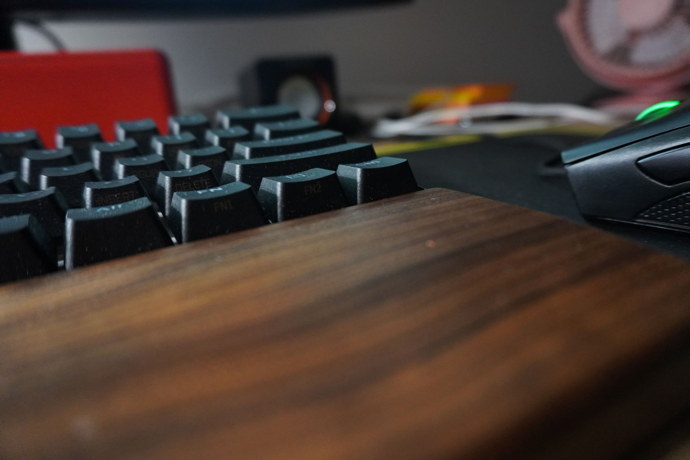

# Test content for hugo

Hugo Theme Stack
Card-style Hugo theme designed for bloggers.

Demo
Example Site

Netlify Status

Documentation
Documentation | 中文文档

Introduction
Stack is a simple card-style Hugo theme designed for bloggers, some of its features are:

Responsive images support
Lazy load images
Dark mode
Local search
PhotoSwipe integration
Archive page template
Full native JavaScript, no jQuery or any other frameworks are used
No CSS framework, keep it simple and minimal
Properly cropped thumbnails
Subsection support
Table of contents
Requirements
It's necessary to use Hugo Extended ≥ 0.87.0.

Installation
Clone / Download this repository to theme folder, and edit your site config following exampleSite/config.yaml.

Note: Remove config.toml if there is one in the site folder.

Check documentation for more details.

Copyright
Licensed under the GNU General Public License v3.0

Please do not remove the "Theme Stack designed by Jimmy" text and link.

If you want to port this theme to another blogging platform, please let me know🙏.

Sponsoring
If you like this theme, give it a star, and consider supporting its development:

ko-fi

Your support is greatly appreciated :)

Thanks to
Project	Description	Licence
PhotoSwipe	For the lightbox effect	MIT
Normalize.css	-	MIT
Node Vibrant	To extract the color from images	MIT
Tabler icons	Default menu icons	MIT
jonsuh/hamburgers	Hamburger icon of menu	MIT
lepture/yue.css	Part of it is used for styling article content	MIT
Typlog	Where the markdown gallery syntax is borrowed from	The author gave me the permission
Pure CSS implementation of Google Photos / 500px image layout	Used for image gallery	-
References
Some references that I took while building this theme:

Project	Licence
artchen/hexo-theme-element	MIT
MunifTanjim/minimo	MIT

